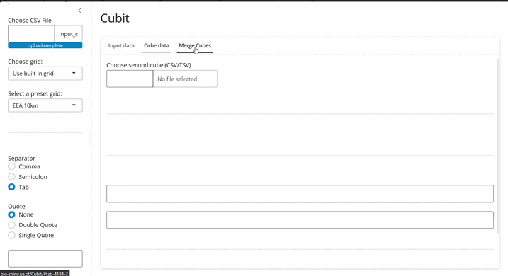
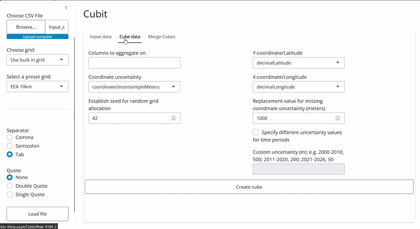

# Introduction

Cubit is an interactive workflow for generating and manipulating **species occurrence cubes**. It provides a graphical interface that allows users to aggregate biodiversity occurrence records into standardized spatial, temporal and taxonomic units without requiring programming experience.

Occurrence cubes are analysis-ready biodiversity datasets in which occurrence records are aggregated along one or more dimensions, typically space, time and taxonomy. Compared to raw occurrence records, cubes are considerably more lightweight, easier to manipulate and directly compatible with the workflows developed within the B-Cubed project.

Cubit has two principal functions:

- create occurrence cubes from user datasets;
- merge occurrence cubes originating from different sources (e.g. GBIF and local datasets).

The application is distributed both as a [web application](https://bio-shiny.ua.pt/Cubit/) and as a [locally installable](https://github.com/b-cubed-eu/Local-Cubit) version. The local version is intended for large datasets and processes input files in chunks to reduce memory usage.

# Input data

## Occurrence data

Cubit accepts biodiversity occurrence datasets separated by comma, semicolon, or tabs.
The web version only accepts files with csv or tsv extensions as input data.
s
Each row should represent one occurrence.

Although Cubit is flexible regarding column names, the dataset must contain at least:

|Information|Required|
|------------|--------|
|Longitude or Y-coordinate|Yes|
|Latitude or X-coordinate|Yes|
|Coordinate uncertainty|Recommended|
|Aggregation variables|Yes|

Typical aggregation variables include

- species
- year
- country
- dataset
- sampling protocol

but users can aggregate on any variables they wish.

Coordinate uncertainty is optional but highly recommended because it is used during the probabilistic allocation of occurrences to grid cells.
If no coordinate uncertainty is present in the dataset a column will be created with the default value for coordinate uncertainty.

## Spatial grids

Cubit requires a spatial grid describing the cells that will define the spatial dimension of the cube.

Users may either

- upload a custom grid (.gpkg format), or
- choose one of the predefined grids included in the application:

|system                                    |cell_size     |example_code    |
|:-----------------------------------------|:-------------|:---------------|
|EEA reference grid                        |1x1 km        |1kmE4731N2620   |
|EEA reference grid                        |10x10 km      |10kmE473N262    |
|EEA reference grid                        |100x100 km    |100kmE47N26     |

# Creating an occurrence cube

## Step 1 — Upload data

Open Cubit and navigate to the **Input Data** panel.

Upload

- the occurrence file;
- optionally, a custom grid.

Select the correct separator (comma, semicolon or tab) and click **Load file**.

A preview of the first rows will appear, allowing verification that the dataset has been imported correctly.

## Step 2 — Configure the cube

Navigate to the **Cube Data** panel.

Here you must specify

- aggregation columns;
- longitude/Y-coordinate column;
- latitude/X-coordinate column;
- coordinate uncertainty column.

Cubit automatically attempts to identify these columns using common names such as

- Longitude
- Latitude
- coordinateUncertainty

but these selections can always be changed manually.

## Step 3 — Configure uncertainty

If coordinate uncertainty is missing for some records, Cubit allows assigning default uncertainty values.

Different defaults may be defined for different time periods when appropriate.

This step ensures that all records can be allocated to grid cells
using the random allocation algorithm described in [Oldoni et al. 2020](https://www.biorxiv.org/content/10.1101/2020.03.23.983601v1.full).

## Step 4 — Set the random seed

The grid allocation algorithm uses pseudo-random numbers.

Providing a random seed guarantees that the cube can be reproduced.

## Step 5 — Generate the cube

Click **Create Cube**.

Cubit will

1. assign occurrences to grid cells;
2. aggregate occurrences;
3. display the occurrence cube (in the web version).

The resulting cube can be downloaded from the web version for further analyses.
In the local version you have to provide a name of a file in the corresponding field.
Then the file will be created in the same folder as the input file.

# Merging occurrence cubes

Cubit can merge cubes produced from different sources.

Examples include

- local monitoring programmes;
- GBIF occurrence cubes;
- institutional databases;
- citizen science projects.

## Step 1 - Upload a new cube

This will be merged with the one you just created,
Alternatively, in the local version you need to upload both cubes;

## Step 2 - map equivalent columns between datasets

Column mapping makes it possible to merge cubes even when equivalent variables have different names.
Note that coordinate uncertainty and occurrence counts columns need to specified in their respective fields,
since they will be processed differently from other dimensions in the cubes.
Other variables can be added through **Add mapping**.

For example:

|Cube A|Cube B|
|-------|------|
|species|scientificName|
|year|eventYear|
|gridID|cell|

Note: cubes can only be merged if they share the same spatial grid (with same format of cellcodes e.g. 100kmE47N26).

## Step 3 - Click the "Merge Cubes" button.

When you are sure that the merged cube is properly configured, you can click the **Merge Cubes** button present below the column mapping.

# Example workflow

Suppose we have a CSV file containing observations collected during a regional monitoring programme.

The dataset contains

- speciesKey;
- decimalLongitude;
- decimalLatitude;
- year (of observation);
- coordinateUncertaintyInMeters.

among other variables.

## Upload

We upload the file, select **comma** as separator, select **No quote** (as the file does not contain quoted strings) and click **Load file**.

## Configure and create the cube

Now we want to create a cube from this data that contains the following information:

- species
- year
- countryCode
- grid cell

Grid cell will be based on the grid and coordinates so it does not need to be present in the original dataset.
The other three variables are the ones the data will be aggregated by.

## Merge with GBIF

Finally, we want to merge the cube we just created with another cube. We upload the second cube into the **Merge Cubes** panel.
We then map equivalent variables (in this case they have the same column names)
Coordinate uncertainty and occurrece counts must be mapped as well but are treated differently, so they must be mapped in the corresponding fields.
Below we can map the rest of the columns of the two cubes that we want the merged cube to have.
If there's additional data in one of the cubes that we don't want to keep in the final cube, we do not need to map it.
Here, we want the final cube to have all the columns of both cubes (speciesKey, countryCode, year, CellCode, coordinateUncertaintyInMeters, count).
After configuring the mapping, we execute the merge.

The resulting cube combines observations from both cubes into a single standardized dataset that can be directly used by downstream B-Cubed workflows.

# Best practices

- Always inspect the imported data preview.
- Use coordinate uncertainty whenever available.
- Set a random seed to ensure reproducibility.
- Use the local version when processing datasets containing millions of records.
- Preserve the original raw dataset and treat Cubit outputs as derived products.

# Downstream applications

Occurrence cubes generated with Cubit can be used for

- biodiversity indicators;
- species distribution modelling;
- sampling completeness analyses;
- assessment of spatial and temporal sampling bias;
- integration with other B-Cubed analytical workflows;
- biodiversity monitoring and reporting.
